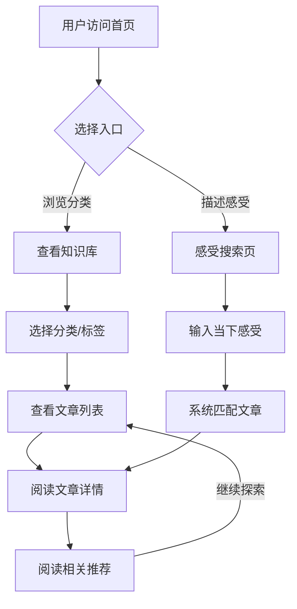

## 1. 产品概述

"心镜"是一个面向大众的心理学知识科普网站，旨在用通俗易懂的语言帮助用户理解心理学概念、认识自身心理状态，从而走出"精神内耗"的困境。目标用户覆盖从小学到大学的学生群体以及社会人士，为他们提供一个免费、专业、温暖的自我认知入口。

- **核心价值**：将专业心理学知识转化为大众可理解的内容，帮助用户正视自身情绪与心理处境，重拾"从头再来"的勇气。
- **社会意义**：降低心理健康认知门槛，让心理知识成为人人都能触及的基础设施，而非高价的付费课程。

## 2. 核心功能

### 2.1 用户角色

| 角色 | 说明 | 核心权限 |
|------|------|----------|
| 普通访客 | 无需注册即可访问 | 浏览所有文章、使用感受搜索功能 |

> 注：V1 版本不设用户注册系统，降低使用门槛，所有内容免费开放。

### 2.2 功能模块

1. **首页**：Hero 引导区、核心数据展示、文章分类导航、精选文章推荐
2. **知识库页面**：按分类浏览心理学文章、关键词标签筛选
3. **文章详情页**：专业名词通俗化解读、相关文章推荐
4. **感受搜索页**：通过描述当下感受，智能匹配相关心理学知识

### 2.3 页面详情

| 页面名称 | 模块名称 | 功能描述 |
|----------|----------|----------|
| 首页 | Hero 引导区 | 一句温暖有力的主标题 + 副标题，引导用户表达感受，配有舒缓的视觉动效 |
| 首页 | 核心数据展示 | 展示心理健康相关数据（如：中国青少年心理问题比例），引发重视 |
| 首页 | 文章分类导航 | 以卡片形式展示主要分类（情绪认知、压力管理、人际关系、自我成长等） |
| 首页 | 精选文章推荐 | 推荐热门/精选文章，带封面图、标题、摘要 |
| 知识库 | 分类筛选栏 | 横向标签切换不同分类，查看对应文章列表 |
| 知识库 | 文章列表 | 卡片式文章列表，展示标题、摘要、分类标签、阅读时长 |
| 文章详情 | 文章正文 | 专业心理学名词的通俗化解读，排版清晰，重点突出 |
| 文章详情 | 关键概念卡片 | 文章核心概念的突出展示，加深理解 |
| 文章详情 | 相关推荐 | 底部推荐 3 篇相关文章，引导继续阅读 |
| 感受搜索 | 搜索输入区 | 用户自由描述当下感受（如"我总觉得自己不够好"），支持多行文本 |
| 感受搜索 | 智能匹配结果 | 根据用户描述匹配最相关的心理学文章，展示匹配度和文章卡片 |

## 3. 核心流程

用户访问网站后，有两条主要路径：

**路径一：主动探索**
```
用户进入首页 → 浏览分类导航 → 选择感兴趣的分类 → 查看文章列表 → 点击文章阅读 → 阅读相关推荐继续探索
```

**路径二：感受搜索**
```
用户进入首页 → 点击搜索入口 → 描述当下感受 → 系统匹配相关文章 → 阅读推荐文章 → 了解自身处境
```



## 4. 用户界面设计

### 4.1 设计风格

- **主色调**：暖米色（#FDF6EE）为底色，搭配鼠尾草绿（#7DA08A）作为主色，暖琥珀色（#D4946A）作为强调色
- **辅助色**：深棕（#4A3728）用于文字，淡灰绿（#E8EFE9）用于卡片背景
- **按钮风格**：圆角柔和按钮，hover 时微放大 + 阴影过渡
- **字体**：标题使用思源宋体（Noto Serif SC），正文使用思源黑体（Noto Sans SC），营造温暖而专业的阅读氛围
- **布局风格**：大留白、宽间距，卡片式布局，内容居中最大宽度 1200px
- **视觉元素**：柔和渐变背景、微妙的纹理叠加、温暖的图标风格

### 4.2 页面设计概览

| 页面名称 | 模块名称 | UI 元素 |
|----------|----------|---------|
| 首页 | Hero 引导区 | 全屏高度，左侧大标题 + 描述 + CTA 按钮，右侧柔和渐变插图，背景带微妙噪点纹理 |
| 首页 | 数据展示 | 3 个数字统计卡片，大号数字 + 简洁说明，带渐入动画 |
| 首页 | 分类导航 | 4 列网格卡片，每张卡片带图标、分类名、简短描述，hover 上浮效果 |
| 首页 | 精选文章 | 横向滚动卡片列表，每张卡片带封面图、标题、摘要、标签 |
| 知识库 | 分类筛选 | 顶部横向标签栏，当前选中标签高亮，带下划线动画 |
| 知识库 | 文章列表 | 2 列网格，卡片含封面图、标题、摘要、标签、阅读时长 |
| 文章详情 | 文章正文 | 居中单栏排版，大标题，适当的行间距和段落间距，关键概念用卡片突出 |
| 文章详情 | 相关推荐 | 底部 3 列卡片网格，与精选文章卡片样式一致 |
| 感受搜索 | 搜索区 | 大面积文本输入框，placeholder 引导文字，提交按钮，整体居中 |
| 感受搜索 | 匹配结果 | 结果卡片列表，展示匹配度百分比、文章标题、摘要 |

### 4.3 响应式设计

- 桌面端优先（1200px 最大宽度），移动端自适应
- 平板端（768px）：分类卡片 2 列，文章列表 2 列
- 手机端（< 768px）：分类卡片 2 列，文章列表 1 列，Hero 区堆叠布局
- 触摸优化：按钮和链接最小 44px 点击区域