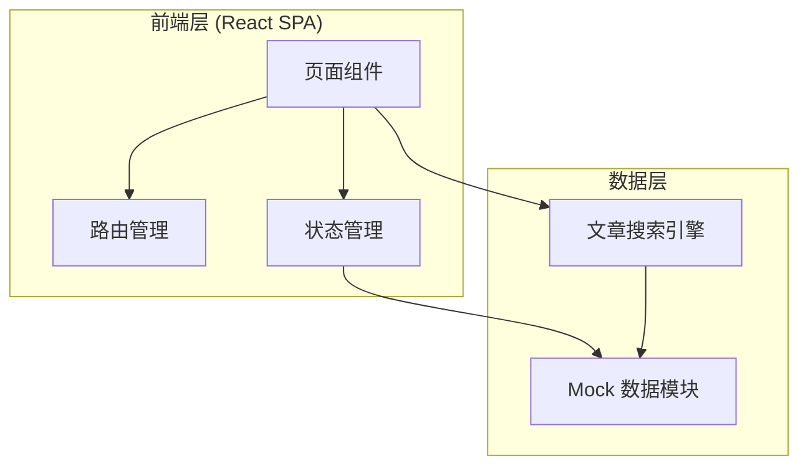

## 1. 架构设计



V1 版本采用纯前端架构，无需后端服务，所有数据通过 Mock 数据模块提供，搜索引擎在前端实现简单的关键词匹配算法。

## 2. 技术选型

| 类别 | 技术 | 说明 |
|------|------|------|
| 框架 | React 18 + TypeScript | 类型安全，组件化开发 |
| 构建工具 | Vite | 快速开发体验，HMR 热更新 |
| 样式方案 | Tailwind CSS 3 | 原子化 CSS，快速构建一致的设计系统 |
| 路由 | React Router v6 | SPA 页面路由 |
| 动画 | Framer Motion | 页面过渡、滚动动画、微交互 |
| 图标 | Lucide React | 轻量、一致的图标库 |
| 数据 | Mock 静态数据 | JSON 文件模拟文章数据，无需后端 |

## 3. 路由定义

| 路由 | 页面 | 说明 |
|------|------|------|
| `/` | 首页 | Hero 引导、数据展示、分类导航、精选文章 |
| `/knowledge` | 知识库 | 按分类浏览文章列表 |
| `/knowledge/:category` | 知识库（分类） | 按指定分类筛选文章 |
| `/article/:id` | 文章详情 | 文章正文 + 相关推荐 |
| `/search` | 感受搜索 | 描述感受，匹配文章 |

## 4. 数据模型

### 4.1 文章数据模型

```typescript
interface Article {
  id: string;
  title: string;
  summary: string;          // 简短摘要
  content: string;           // Markdown 正文
  category: Category;
  tags: string[];            // 关键词标签
  keywords: string[];        // 用于搜索匹配的关键词
  readTime: number;          // 预计阅读时长（分钟）
  coverImage: string;        // 封面图 URL
  keyConcept?: {             // 核心概念卡片
    term: string;            // 专业术语
    explanation: string;     // 通俗解释
  };
  relatedIds: string[];      // 相关文章 ID
  createdAt: string;
}

type Category = 'emotion' | 'stress' | 'relationship' | 'self-growth' | 'anxiety' | 'other';
```

### 4.2 分类定义

```typescript
interface CategoryInfo {
  id: Category;
  name: string;              // 中文名称
  description: string;       // 简短描述
  icon: string;              // Lucide 图标名
  color: string;             // 分类主题色
}
```

### 4.3 搜索匹配模型

```typescript
interface SearchResult {
  article: Article;
  matchScore: number;        // 匹配度 0-100
  matchedKeywords: string[]; // 匹配到的关键词
}
```

## 5. 组件树

```
App
├── Layout
│   ├── Navbar（顶部导航：Logo、导航链接、搜索入口）
│   └── Footer（版权信息、链接）
├── Pages
│   ├── HomePage
│   │   ├── HeroSection（引导区）
│   │   ├── StatsSection（数据展示）
│   │   ├── CategorySection（分类导航）
│   │   └── FeaturedArticles（精选文章）
│   ├── KnowledgePage
│   │   ├── CategoryFilter（分类筛选栏）
│   │   └── ArticleCard[]（文章卡片列表）
│   ├── ArticlePage
│   │   ├── ArticleContent（正文内容）
│   │   ├── KeyConceptCard（核心概念卡片）
│   │   └── RelatedArticles（相关推荐）
│   └── SearchPage
│       ├── SearchInput（感受输入区）
│       └── SearchResultCard[]（匹配结果）
└── Shared
    ├── ArticleCard（文章卡片组件）
    ├── TagBadge（标签徽章）
    └── LoadingSpinner（加载动画）
```

## 6. Mock 数据规模

| 数据类型 | 数量 | 说明 |
|----------|------|------|
| 文章 | 12 篇 | 覆盖 6 个分类，每个分类 2 篇 |
| 分类 | 6 个 | 情绪认知、压力管理、人际关系、自我成长、焦虑缓解、青少年心理 |
| 统计数据 | 3 条 | 首页数据展示 |